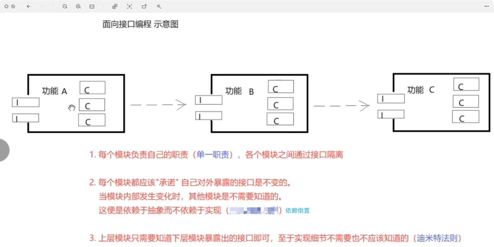
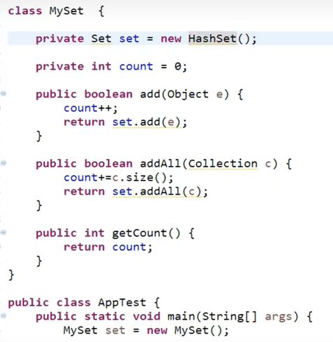
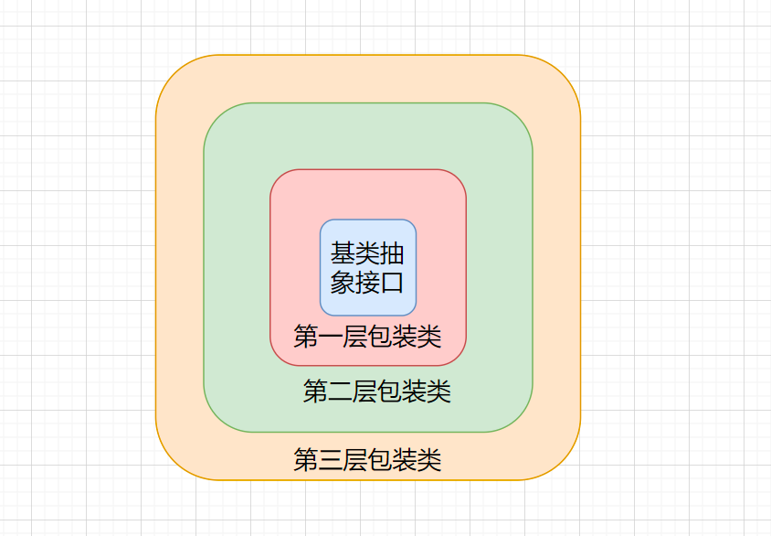

#设计模式
##七大设计原则

###单一原则
    简单来说就是每个方法、每个类、每个框架只干一件事情，这样有利于代码的可重用性、提高代码阅读等等。
###开闭原则
    对拓展开放，对修改关闭。
###接口隔离原则
    类似于单一原则，针对于接口。每个接口只做各自接口的事情，而不应该设置总接口，这样会导致耦合度增高
###依赖倒置原则
    要针对接口编程，不要针对实现编程。
    好处：
        1.降低代码间的耦合
        2.提高系统稳定性
        3.减少并发并行引起的风险
        4.提高代码的可读性和稳定性
    编程时需要遵循的规则：
        每个类尽量提供接口或抽象类，或者两者都具备。
        变量的声明类型尽量是接口或者是抽象类
        任何类都不应该从具体类派生
        使用继承时尽量遵循里氏替换原则
###迪米特法则（最少知道原则）
    只与你的直接朋友交谈，不跟“陌生人”说话
    朋友的定义：
        当前对象本身(this)
        以参数形式传入到当前对象方法中的对象
        当前对象的成员对象
        如果当前对象的成员对象是一个集合，那么集合中的元素也都是朋友。
        当前对象创建的对象
    优点：
        1、降低代码耦合，代码相对独立
        2、因为降低耦合，所以提高代码复用性和拓展性
    缺点：
        会产生很多的中间类，增加了代码的复杂度，提高了模块间的通信效率
###里氏替换原则
    介绍：
        这个原则的核心思想就是在程序当中，如果将一个父类对象替换成它的子类对象后，该程序不会发生异常。
        子类可以扩展父类的功能，但不能改变父类原有的功能。
    优点:
        1、代码共享，减少创建类的工作量，每个子类都拥有父类的方法和属性；
        里氏替换原则通俗来讲就是：子类可以扩展父类的功能，但不能改变父类原有的功能。
        也就是说：子类继承父类时，除添加新的方法完成新增功能外，尽量不要重写父类的方法。
        2、提高代码的重用性；
        3、子类可以形似父类，但又异于父类，“龙生龙，凤生凤，老鼠生来会打洞”是说子拥有父的“种”
        4、“世界上没有两片完全相同的叶子”是指明子与父的不同；
        5、提高代码的可扩展性，实现父类的方法就可以“为所欲为”了，君不见很多开源框架的扩展接口他都是通过继承父类来完成的；
        6、提高产品或项目的开放性。
    缺点：
        1、继承是侵入性的。只要继承，就必须拥有父类的所有属性和方法；
        2、降低代码的灵活性。子类必须拥有父类的属性和方法，让子类自由的世界中多了些约束；

###组合优于继承原则
        类和类之间的三种关系：
        1、继承
        2、依赖    局部变量
        3、关联    成员变量
            分为：组合、聚合
                组合 例子：鸟和翅膀(关系强)
                聚合 例子：大雁和雁群(关系弱)、电脑和usb
    使用继承的坏处：
        1、当我们继承了一个类并重写其中方法后，之后本项目调用父类方法时会先查看子类是否有这个方法，有则会调用子类重写的方法。
            如果差别很大，可能会造成调用者出现很多不必要的问题。
        2、如果我们重写的方法调用了子类的方法，这时父类中添加或修改了一些方法，这样也会导致程序出现问题。
    使用组合：
        1、并未继承，只需要添加自己的方法，在调用需要的方法即可，也不会改变原本方法的逻辑，这样当这个别的类调用这个
            方法时也不会出现问题
    什么时候使用继承：子父类都为同一人编写时可以使用。如果不是同一人编写建议使用关联。

##目录
    -- factory 工厂模式
        -- factory_method 工厂方法模式   分为抽象产品、抽象工厂、具体产品、具体工厂   
        -- simple_factory 简单工厂(静态工厂方法模式)
        -- abstract_factory 抽象工厂
    -- prototype 原型模式
        -- shen 深克隆
    -- builder 建造者模式
    -- decorator 装饰器模式
    -- adapter 适配器模式 
        -- class_adapter 类适配器
        -- object_adapter 对象适配器
    -- proxy 代理模式
        -- cglib 动态代理
        -- jdk  动态代理
        -- static 静态代理
    -- 策略模式
        -- 
    -- 组合模式
        -- 
    -- facade 外观模式
    -- bridging 桥接模式 

### 原型模式
    作用：创建重复对象，同时又能保证性能。
        这种模式是实现了一个原型接口，该接口用于创建当前对象的克隆。当直接创建对象的代价比较大时，则采用这种模式。
            例如，一个对象需要在一个高代价的数据库操作之后被创建。我们可以缓存该对象，在下一个请求时返回它的克隆，
                在需要的时候更新数据库，以此来减少数据库调用。
    简单来说就是：利用已有的一个原型对象，快速地生成和原型对象一样的实例。
    包含角色：
        抽象原型类：规定了具体原型对象必须实现的clone()方法。
        具体原型类：实现抽象原型的clone()方法，它就可以复制对象了。
        访问类：使用具体原型类中的clone()方法来复制新的对象。
    原型模式分为深克隆和浅克隆：
        浅克隆：创建一个新对象，新对象的属性和原来对象完全相同，对非基本数据类型，依然指向原来对象所指向的内存地址。
        深克隆：创建一个新对象，属性中引用其他对象也会被克隆，不再指向原来的内存地址。
    优点：
        1、性能提高。 
        2、逃避构造函数的约束。
    缺点： 
        1、配备克隆方法需要对类的功能进行通盘考虑，这对于全新的类不是很难，但对于已有的类不一定很容易，特别当一个类引用不支持串行化的间接对象，或者引用含有循环结构的时候。 
        2、必须实现 Cloneable 接口。
### 建造者模式
    包含角色：
        产品角色(Bike)：要创建的复杂对象。
        抽象建造者(builder)：实现复杂对象的部分创建，并不涉及具体的对象部分的创建。
        具体建造者(MobikeBuilder、OfoBuilder)：实现builder接口,完成复杂对象的各个部件具体创建方法，提供产品实例
        指挥者(Director)：
    建造者模式和工厂模式的区别：
        工厂模式：直接实例化对象即可
        建造者模式：在实例化对象之后还要对属性进行赋值
        1、通过上面对建造者模式的使用，已经可以摸索出一点⼼得。那就是什么时候会选择这样的设计模式，
            当： ⼀些基本物料不会变，⽽其组合经常变化的时候 ，就可以选择这样的设计模式来构建代码。
        2、此设计模式满足了了单一职责原则以及可复用的技术、建造者独立、易扩展、便于控制细节⻛风险。但
        同时当出现特别多的物料以及很多的组合后，类的不断扩展也会造成难以维护的问题。但这种设计
        结构模型可以把复的内容抽象到数据库中，按照需要配置。这样就可以减少代码中大量的复。
        3、设计模式能带给你的是⼀些思想，但在平时的开发中怎么样清晰的提炼出符合此思路路的建造模块，
        是比较难的。需要经过⼀些锻炼和不断承接更多的项⽬，从而获得这部分经验。有的时候你的代码
        写的好，往往是倒逼的，复杂的业务频繁的变化，不断的挑战！
### 装饰器模式
    介绍：允许在不改变原来的更能的前提下动态的添加新的功能。
    包含角色：
        抽象构建(FastFood)：基类，定义了需要的方法
        具体构建(FriedRice、FriedRice)：继承基类
        抽象装饰(Garnish)：继承或实现抽象组件，持有一个抽象组件的引用，可以调用被装饰对象的方法，并且可以在其前后增加新的功能。
        具体装饰(Egg、Bacon)：实现抽象装饰者的方法，给被装饰对象增加具体的职责。

    ``可以这样理解我们只是在抽象构建者类上加东西，并且不影响原本的功能``
#### 装饰者模式的优点有：
- 可以在不修改原有对象的基础上给对象增加新的功能，遵循开闭原则。
- 可以使用多个具体装饰者来组合出不同的功能，实现灵活性和可扩展性。
- 可以根据需要动态地增加或删除功能，而不影响其他对象。
- 可以保持被装饰对象的类型和接口不变，对客户端透明。
#### 装饰者模式的缺点有：
- 会增加系统的复杂度和类的数量，可能导致代码难以理解和维护。
- 会增加对象之间的耦合度，可能引入循环引用的问题。
- 会影响被装饰对象的效率和性能。
- 动态地多层装饰时，调试和维护比较困难
#### 使用场景
- 当需要给一个现有类添加附加职责，而又不能采用生成子类的方法进行扩充时。例如，该类被隐藏或者该类是终极类或者采用继承方式会产生大量的子类。
- 当需要通过对现有的一组基本功能进行排列组合而产生非常多的功能时，采用继承关系很难实现，而采用装饰器模式却很好实现。
- 当对象的功能要求可以动态地添加，也可以再动态地撤销时。
### 适配器模式
    介绍：适配器就是将一个类的接口转换为客户需要的另一个接口，使原本由于接口不兼容而不能一起工作的那些类一起工作。(例：将两口插座转换为三口使用)
    包含角色：
        目标接口(Computer)：我们需要转换的接口，也就是目前没有的接口(三口插座)
        适配者类(SDCard、TFCard)：这里指的就是原本的接口（两口插座）
        适配器类(SDAdapterTF)：用于转换的类(将三口插座转化为两口插座)
        
### 桥接模式
    介绍：桥接模式是指，将抽象与实现分离，是他们可以独立变化。它是用组合关系代替继承关系来实现，从而降低抽象和实现这两个纬度的耦合度。
    解释：
        好比不同品牌的手机有不同的颜色。手机和颜色就是不同的纬度。
    角色：
        抽象化角色(OperatingSystem)：就是说该抽象类把实现化角色对象给聚合进来了
        扩展抽象化角色(Windows、mac)：是抽象化角色的子类，实现父类中的业务方法，并通过组合关系调用实现化角色中的业务方法。因为在父类中已经聚合了实现化角色对象，所以我们就可以调用实现化角色对象里面的业务方法了
        实现化角色(VideoFile)：定义实现化角色的接口（注意，这里可以是接口也可以是抽象类），供扩展抽象化角色调用
        具体实现化角色(AviFile、RmvFile)：给出实现化角色接口的具体实现
    具体通过代码的方式来体现。
    需求：现在需要开发一个跨平台播放器，每个平台都会有各种格式的播放文件。这里各个平台和播放文件就是不同纬度的

    好处：
        1、在不同纬度扩展都不需要改变原来的代码，符合开闭原则
        2、实现细节对客户透明
    使用场景：
        1、当一个类存在不同的纬度。并且这些纬度都需要拓展
        2、当一个系统不想用继承或者经过多次继承后导致系统类急剧飙升
        3、当一个系统需要在构件的抽象化角色和具体化角色之间增加更多的灵活性时。此时，我们应避免在两个层次之间建立静态的继承联系，
            而是通过桥接模式使它们在抽象层建立一个关联关系，注意了，这里面主要指的是聚合关系。

### 外观模式
    很多人都有炒过股，但在不了解的情况下很容易亏钱，这是我们会想，如果找一个懂行的人来帮我们就好了。在基金中，我们就可以将钱交给这些职业的经理人。
    让我们来帮我们投哪些公司。这种就狠想外观模式。
    介绍：外观模式又叫门面模式。就是很多子系统提供一个统一的接口，这样我们就能很方便的进行访问的模式。
    角色：
        外观角色()：为多个子系统对外提供统一的接口
        子系统角色()：实现系统的部分功能，客户可以通过外观角色来访问它

·
### 动态代理
    包含角色：
        抽象主题类：定义主题类和代理类的一些规范，供他们实现
        真实主题类：实现抽象主题类。是需要被代理的类
        代理类：实现抽象主题类，对需要代理的类进行增强
    java中代理按照代理类生成的时机不同而分为静态代理和动态代理
        静态代理：代理类在编译期就生成了
        动态代理：代理类在java运行时动态生成。动态代理分为：jdk动态代理和cglib动态代理

